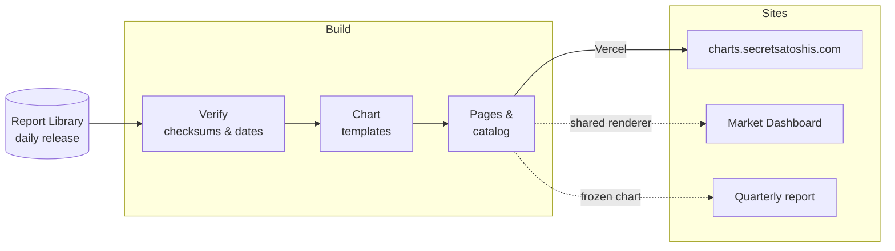

# Bitcoin Chart Library

Interactive Bitcoin charts from [Secret Satoshis](https://secretsatoshis.com). Every chart
is a fast, static page built from the [Bitcoin Report Library](https://github.com/SecretSatoshis/Bitcoin-Report-Library)'s
daily data release and drawn with TradingView Lightweight Charts.

- **Browse the charts:** [charts.secretsatoshis.com](https://charts.secretsatoshis.com)
- **Get the data behind them:** [Report Library release](https://secretsatoshis.github.io/Bitcoin-Report-Library/)

## What's in it

46 charts in nine categories:

| Category | Covers |
|----------|--------|
| **Price & Trends** | Price, moving averages, purchasing power and volatility |
| **Returns & Comparisons** | Bitcoin's returns and how they compare with other assets |
| **Cycles & Seasonality** | Halving cycles, drawdowns, cycle lows and month/year patterns |
| **Valuation Models** | Realized price, thermocap, NVT, power law, Metcalfe and electricity cost |
| **Relative Valuation** | Bitcoin's size against precious metals, big tech, chipmakers and base money |
| **Holder Sentiment** | NUPL, SOPR, reserve risk and supply in profit |
| **Supply** | Issuance, holder supply and coin age |
| **Network Activity** | Transactions, fees, transfer volume and addresses |
| **Mining & Security** | Hashrate, difficulty, hash price and miner revenue |

Every chart lets you switch ranges, toggle series, change between log and linear scales
and export a PNG or the chart's data. Charts of Bitcoin's price can also show candles. Pages also work offline:
open any HTML file from a build with its `assets/` folder beside it.

## How it works



Each build checks every input against the release's checksums and refuses a release that is
stale or inconsistent, so a bad release never reaches the site. Vercel builds the site on
every push to `main`, and the Report Library asks it to rebuild after each release. A manual
run of the GitHub Actions workflow tests the code and rebuilds the site.

## Quick start

You need Python 3.12 and [uv](https://docs.astral.sh/uv/).

```bash
git clone https://github.com/SecretSatoshis/Bitcoin-Chart-Library.git
cd Bitcoin-Chart-Library
uv sync --locked
```

Build the charts from the live release into `Charts/`, then test them:

```bash
uv run --no-sync python main.py
uv run --no-sync pytest -q
```

To build from a local Report Library checkout and preview at http://127.0.0.1:8767/:

```bash
uv run --no-sync python main.py --csv-dir ../Bitcoin-Report-Library/csv --serve
```

Browser checks need Node 24:

```bash
npm ci
npx playwright install chromium
npm run test:browser
```

## Add a chart

Add a definition to a `CHARTS` list in `chart_templates/`; the build picks it up
automatically:

```python
{
    'filename': 'Bitcoin_New_Comparison',   # public URL, must be unique
    'title': 'Bitcoin New Comparison',
    'description': 'What the chart compares and what a reader can learn from it.',
    'category': 'Price & Trends',
    'family': 'timeseries',
    'data_source': 'Data Source: BRK',
    'filter_start_date': '2010-07-01',
    'default_range': '4Y',
    'axes': {'right': {'label': 'Bitcoin Price (USD)', 'unit': 'USD', 'mode': 'log'}},
    'y_data': [{'name': 'Bitcoin Price', 'data': 'price_close', 'axis': 'right'}],
}
```

Series use columns the Report Library already publishes; new calculations belong there.
Look at existing templates for second axes, stacked `panels`, value bands and candle
defaults. Run the build and tests before opening a pull request.

## Project layout

| Path | What's there |
|------|--------------|
| `main.py` | Builds the site |
| `chart_inputs.py`, `candle_inputs.py` | Load and verify a Report Library release |
| `chart_templates/` | Chart definitions, categories and shared events |
| `chart_data.py` | Turns a template and the release into chart data |
| `chart_style.py` | Series colours |
| `chart_build.py`, `chart_catalog.py` | Pages, catalog, search metadata and sitemap |
| `web/` | Page template, renderer, styles, catalog page, fonts and vendored chart library |
| `scripts/` | Browser checks and the dashboard sync |
| `tests/` | Python tests |

## Shared with other sites

- **Market Dashboard:** draws its charts with this renderer. After changing anything in
  `web/`, run `uv run --no-sync python scripts/sync-dashboard.py ../Bitcoin-Report-Library/dashboard/static/shared-chart`
  and commit the result in the Report Library.
- **Quarterly report:** the newsletter uses `chart_build.build_single` to render a chart
  against an earlier, frozen release.

## License

[GPL-3.0](LICENSE). The data comes from third-party sources and keeps their terms.
TradingView Lightweight Charts (`web/vendor/`) is Apache 2.0, and the fonts (`web/fonts/`)
are under the SIL Open Font License.
